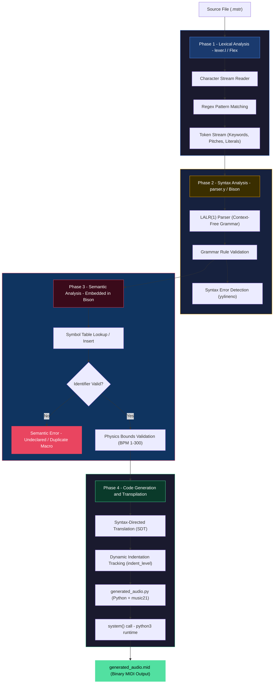
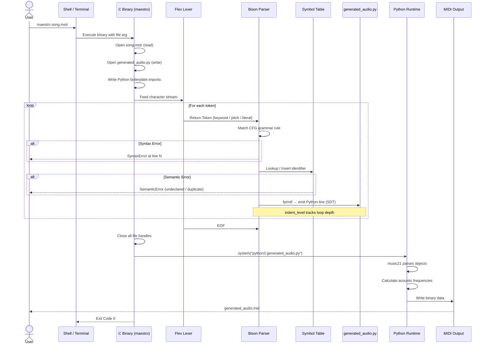

<div align="center">

<h1>MaestroLang</h1>
<h3>An Algorithmic Music Compiler</h3>
<p align="center">
  <b>A fully custom Domain-Specific Language and compiler that transforms algorithmic music syntax into playable MIDI audio files.</b>
</p>

<!-- Core Stack Badges -->
<p>
  
  
  
  
  
</p>

<!-- Status Badges -->
<p>
  
  
  
  
</p>

<p align="center">
<a href="#overview">Overview</a> •
<a href="#architecture">Architecture</a> •
<a href="#execution-flow">Execution Flow</a> •
<a href="#language-syntax">Syntax</a> •
<a href="#tech-stack">Tech Stack</a> •
<a href="#quick-start">Quick Start</a> •
<a href="#local-build">Local Build</a> •
<a href="#project-structure">Structure</a>
</p>

</div>

---
<a id="overview"></a>
##  Overview

**MaestroLang** is a production-grade, custom-built **Domain-Specific Language (DSL) and compiler**, engineered entirely from scratch. It introduces a clean, C-style musical grammar and compiles it into fully playable **binary MIDI (`.mid`) audio files** — without writing a single note in a traditional DAW.

Rather than targeting machine code or assembly, MaestroLang employs **Source-to-Source Compilation (Transpilation)**: a C-based compiler frontend (Flex + Bison) performs all lexical, syntactic, and semantic validation, then emits intermediate Python targeting the `music21` audio engine, which is auto-executed to produce the final audio artifact.

> **Design Philosophy:** Zero-friction compilation. One command in. One `.mid` file out.

### Key Engineering Highlights

| Capability | Implementation |
|---|---|
| Lexical Analysis | Flex (regex-based tokenizer) |
| Syntax Parsing | GNU Bison (LALR(1) CFG) |
| Semantic Validation | C-based Symbol Table (in-memory string array) |
| Code Generation | Syntax-Directed Translation (SDT) — no AST required |
| Audio Output | Python `music21` library |
| OS Independence | Docker containerization |
| Cross-Platform | macOS, Linux, Windows (WSL2 + PowerShell) |

---
<a id="architecture"></a>
##  Architecture

The compiler follows a strict **4-phase pipeline**. Each phase transforms the representation of the program before handing off to the next stage.



---
<a id="execution-flow"></a>
##  Execution Flow

End-to-end lifecycle from user keystroke to audio file — step by step.



---
<a id="language-syntax"></a>
##  Language Syntax

MaestroLang uses a clean, C-style syntax specifically designed for algorithmic music composition. Source files use the `.mstr` extension.

### Full Language Reference

| Keyword | Description | Example |
|---|---|---|
| `Track` | Top-level music block. Wraps all composition logic. | `Track "BossFight" { ... }` |
| `Tempo` | Sets the BPM (1–300). Validated at compile time. | `Tempo 150;` |
| `Play` | Plays a single note with a specified duration. | `Play C4(quarter);` |
| `Chord` | Plays multiple notes simultaneously (polyphony). | `Chord [C4, E4, G4](half);` |
| `Repeat` | Bounded loop. Generates a Python `for` block. | `Repeat 4 { ... }` |
| `Define` | Declares a reusable macro (musical phrase). | `Define Bassline { ... }` |
| `PlayMacro` | Invokes a previously defined macro. | `PlayMacro Bassline;` |
| `//` `/* */` | Single-line and multi-line comments. Stripped at lex phase. | `// tempo comment` |

### Supported Note Durations

```
whole  |  half  |  quarter  |  eighth  |  sixteenth
```

### Pitch Format

Pitches follow standard scientific pitch notation, validated by Flex regex `[A-G][b#]?[0-9]`:

```
C4   D#3   Eb5   F#2   G6   A2   Bb4
```

### Complete Example — `boss_fight.mstr`

```javascript
Track "BossFight" {
    Tempo 150; // Fast-paced combat tempo

    /* ── Reusable Phrases (Macros) ── */
    Define Bassline {
        Play A2(eighth);
        Play E3(eighth);
        Play A2(eighth);
        Play F3(eighth);
    }

    Define TensionRiff {
        Play D4(sixteenth);
        Play F4(sixteenth);
        Play A4(eighth);
    }

    /* ── Build the tension: 4x loop ── */
    Repeat 4 {
        PlayMacro Bassline;
        PlayMacro TensionRiff;
    }

    /* ── Dramatic polyphonic finale ── */
    Chord [A3, C4, E4](whole);
    Chord [F3, A3, C4](whole);
    Chord [G3, B3, D4](half);
    Chord [A3, E4, A4](whole);
}
```

---
<a id="tech-stack"></a>
##  Tech Stack

### Core Compiler Infrastructure

<table>
  <tr>
    <td align="center" width="120">
      
      <br/><b>C / GCC</b>
      <br/><sub>Compiler core, Symbol Table, system() handoff</sub>
    </td>
    <td align="center" width="120">
      
      <br/><b>Python 3</b>
      <br/><sub>Generated target code runtime</sub>
    </td>
    <td align="center" width="120">
      
      <br/><br/><b>Flex</b>
      <br/><sub>Fast Lexical Analyzer — tokenization</sub>
    </td>
    <td align="center" width="120">
      
      <br/><br/><b>GNU Bison</b>
      <br/><sub>LALR(1) parser generator — grammar + SDT</sub>
    </td>
  </tr>
  <tr>
    <td align="center" width="120">
      
      <br/><b>Docker</b>
      <br/><sub>OS-independent containerized build & run</sub>
    </td>
    <td align="center" width="120">
      
      <br/><b>GNU Make</b>
      <br/><sub>Build automation via Makefile</sub>
    </td>
    <td align="center" width="120">
      🎵
      <br/><b>music21</b>
      <br/><sub>Python audio engine — MIDI generation</sub>
    </td>
    <td align="center" width="120">
      🪟
      <br/><b>WSL2</b>
      <br/><sub>Windows native execution environment</sub>
    </td>
  </tr>
</table>

### Stack Breakdown by Compiler Phase

```
┌─────────────────────────────────────────────────────────────────────────────┐
│                        MaestroLang Compiler Stack                           │
├─────────────────┬───────────────────────────────────────────────────────────┤
│ PHASE           │ TECHNOLOGY                                                 │
├─────────────────┼───────────────────────────────────────────────────────────┤
│ Lexical         │ Flex  →  Regex tokenization of .mstr source               │
│ Syntactic       │ GNU Bison  →  LALR(1) Context-Free Grammar enforcement    │
│ Semantic        │ C (embedded in parser.y)  →  Symbol Table, BPM bounds     │
│ Code Generation │ C fprintf + SDT  →  writes generated_audio.py on the fly  │
│ Audio Rendering │ Python 3 + music21  →  MIDI binary file production        │
│ Build System    │ GNU Make  →  links Flex/Bison/GCC outputs                 │
│ Distribution    │ Docker (python:3.9-slim base)  →  cross-OS execution      │
└─────────────────┴───────────────────────────────────────────────────────────┘
```

---
<a id="quick-start"></a>
##  Quick Start

> **Recommended:** Use Docker for a zero-dependency, cross-platform experience. No GCC, Flex, Bison, or Python required on your host machine.

### Step 1 — Clone

```bash
git clone https://github.com/YOUR_USERNAME/MaestroLang.git
cd MaestroLang
```

### Step 2 — Build the Docker Image

```bash
docker build -t maestrolang .
```

> This installs GCC, Flex, Bison, Python, and `music21` inside a clean Linux container and compiles the `maestro` binary.

### Step 3 — Write Your Song

Create a file called `song.mstr` in your current directory using the [language syntax](#-language-syntax) above.

### Step 4 — Compile & Play

<table>
<tr>
<th>macOS / Linux</th>
<th>Windows PowerShell</th>
</tr>
<tr>
<td>

```bash
docker run --rm \
  -v $(pwd):/work \
  maestrolang song.mstr
```

</td>
<td>

```powershell
docker run --rm `
  -v ${PWD}:/work `
  maestrolang song.mstr
```

</td>
</tr>
</table>

**Output:** `generated_audio.mid` will appear in your current directory. Open it with any MIDI player, GarageBand, VLC, or import into a DAW.

---
<a id="local-build"></a>
##  Local Build

### macOS / Linux

**Prerequisites:**

```bash
# Install compiler tools (macOS with Homebrew)
brew install gcc flex bison

# Or on Ubuntu/Debian
sudo apt update && sudo apt install gcc make flex bison

# Install Python audio engine
pip3 install music21
```

**Build:**

```bash
make clean && make

# (Optional) Install globally
sudo cp maestro /usr/local/bin/
```

**Run:**

```bash
maestro my_song.mstr
# → Compilation successful! Generating audio...
# → generated_audio.mid created.
```

---

### Windows (via WSL2)

Windows does not natively support GCC, Flex, or Bison. The standard path is **WSL2 (Windows Subsystem for Linux)**.

**Step 1 — Enable WSL2**

```powershell
# Run in PowerShell as Administrator
wsl --install
# Restart when prompted, then open the Ubuntu terminal app
```

**Step 2 — Install Dependencies**

```bash
sudo apt update
sudo apt install gcc make flex bison python3 python3-pip
pip3 install music21
```

**Step 3 — Build & Run**

```bash
git clone https://github.com/YOUR_USERNAME/MaestroLang.git
cd MaestroLang
make clean && make
./maestro my_song.mstr
```

**Access your output file from Windows Explorer:**

```bash
explorer.exe .
```

---
<a id="project-structure"></a>
##  Project Structure

```
MaestroLang/
│
├── lexer.l               # Flex: Regex rules, token definitions, comment stripping
├── parser.y              # Bison: CFG grammar, SDT actions, Symbol Table, Semantic checks
├── Makefile              # Build automation: links Flex + Bison + GCC outputs → 'maestro'
├── Dockerfile            # Container: python:3.9-slim + GCC/Flex/Bison + music21 setup
│
├── examples/
│   ├── boss_fight.mstr   # Example: fast-paced combat theme with loops and macros
│   ├── pop.mstr          # Example: pop chord progressions
│   └── ambient.mstr      # Example: slow ambient textures
│
└── README.md             # This file
```

---

##  Compiler Internals Deep-Dive

<details>
<summary><b>Symbol Table Design</b></summary>

<br/>

The Symbol Table is implemented as a fixed-size C string array embedded directly in `parser.y`. It performs two operations:

- **Insert** (`define_macro`): When `Define <Name>` is parsed, the identifier string is appended to the table. If it already exists, a `Semantic Error: Macro '<Name>' already defined` is raised and compilation halts.
- **Lookup** (`lookup_macro`): When `PlayMacro <Name>` is parsed, a linear search is performed. If the identifier is not found, a `Semantic Error: Undeclared Macro '<Name>'` is raised.

This deliberately avoids heap allocation, making the compiler fast and memory-safe for the bounded macro scope of a single `Track` block.

</details>

<details>
<summary><b>Syntax-Directed Translation (SDT) — No AST</b></summary>

<br/>

Traditional compilers build an Abstract Syntax Tree (AST) and then perform a separate tree-walk code generation pass. MaestroLang eliminates this overhead by using **Syntax-Directed Translation**: C `fprintf` commands are embedded directly inside Bison grammar rule actions and fire immediately upon a successful parse match.

Example SDT mapping:

| MaestroLang Input | Emitted Python (generated_audio.py) |
|---|---|
| `Tempo 120;` | `s.append(tempo.MetronomeMark(number=120))` |
| `Play C4(quarter);` | `p.append(note.Note('C4', type='quarter'))` |
| `Chord [C4,E4,G4](half);` | `p.append(chord.Chord(['C4','E4','G4'], type='half'))` |
| `Repeat 4 {` | `for _i in range(4):` + `indent_level++` |
| `}` (close Repeat) | `indent_level--` |
| `Define Bassline {` | Python function def + Symbol Table insert |
| `PlayMacro Bassline;` | Python function call + Symbol Table lookup |

</details>

<details>
<summary><b>Dynamic Indentation Tracking</b></summary>

<br/>

Python enforces syntactic whitespace. Because MaestroLang generates Python code via `fprintf` calls in C without building an AST, indentation must be tracked dynamically at parse-time.

A global integer `indent_level` is maintained in `parser.y`:
- **Incremented** when a `Repeat` or `Define` block opens (`{`)
- **Decremented** when the matching close brace (`}`) is reduced

Every `fprintf` call for a Python statement prepends `indent_level × 4` spaces before writing the code line. This produces correctly indented, syntactically valid Python from first principles.

</details>

<details>
<summary><b>Docker Containerization Strategy</b></summary>

<br/>

**Challenge:** C binaries are architecture-specific. A binary compiled on an Apple Silicon Mac will not run on a Windows x86_64 machine.

**Solution:** The `Dockerfile` packages the entire compiler toolchain:

```dockerfile
FROM python:3.9-slim

# Install C toolchain + parser generators
RUN apt-get update && apt-get install -y \
    gcc make flex bison

# Install Python audio engine
RUN pip install music21

# Copy source and compile inside the container
COPY . /app
WORKDIR /app
RUN make clean && make

# Set the compiled binary as the container entrypoint
ENTRYPOINT ["/app/maestro"]
```

**Volume Mapping** (`-v $(pwd):/work`) mounts the user's local directory as `/work` inside the container. The compiler reads the `.mstr` file and writes `generated_audio.mid` to `/work`, which resolves directly to the user's host filesystem. The container exits immediately after — zero residual state.

</details>

---

##  Contributing

Contributions, issues, and feature requests are welcome.

```bash
# Fork the repo, create a feature branch, and submit a PR
git checkout -b feature/multi-track-support
git commit -m "feat: add multi-track instrument layer"
git push origin feature/multi-track-support
```

Please open an issue first to discuss significant changes.

---

##  License

Distributed under the **MIT License**. See `LICENSE` for full details.

---

<div align="center">

**MaestroLang** — where compiler theory meets music theory.

<i>Built with passion for the intersection of Code and Sound.</i>

</div>
